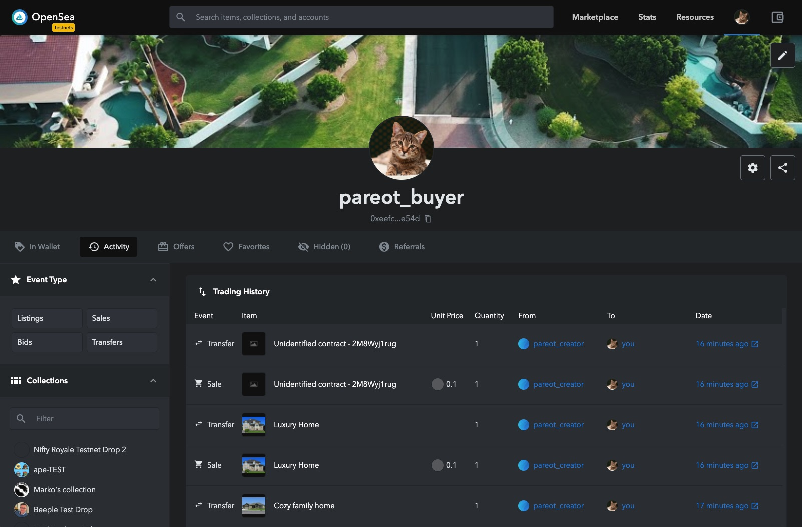
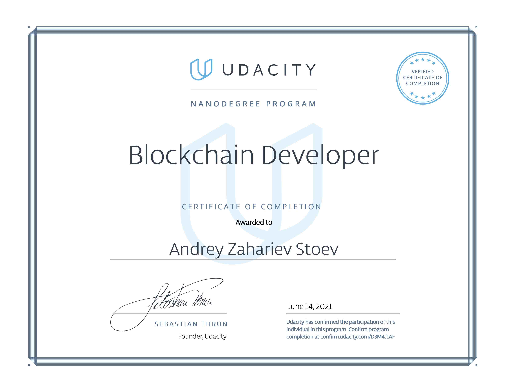

## With These 5 Projects I Upgraded My Skills To A New Level: Certified Blockchain Developer

- certification program:
  [Udacity - Blockchain Developer Nanodegree Program](https://www.udacity.com/course/blockchain-developer-nanodegree--nd1309)
- duration: 4 months, 10h+/week
- activity: mind-blowing theory & development of 5 reviewed blockchain projects

### [Project 1 - Private Blockchain Digital Assets NodeJS](project1-private-blockchain-digital-assets-nodejs/README.md)

### Project 2 - Ethereum NFT Crypto Start Dapp

Ethereum CryptoStar Dapp is a star register.

- The star can be created and looked for
- Use non-fungible token (ERC-721)

### Project 3 - Ethereum SupplyChain Dapp

Ethereum SupplyChain is a supply chain item's tracker.

- The product's authenticity can be tracked and audited
- The smart contracts have a fine-grain user permission's management

### Project 4 - Ethereum FlightSurety Dapp

Ethereum FlightSurety Dapp is a flight delay insurance for passengers.

- Managed as a collaboration between multiple airlines
- The passengers purchase insurance prior to flight
- If flight is delayed due to airline fault, passengers are paid 1.5X the amount they paid for the insurance
- Oracles provide flight status information

### Project 5 - Ethereum RealEstateMarketplace Dapp

Ethereum RealEstateMarketplace Dapp is a decentralized marketplace for house property owners.

- Every house property is mint as NFT
- zk-SNARKs proof protects the title's ownership privacy
- A title ownership can be verified through an ethereum solidity contract
- House properties can be traded on a public NFT marketplace OpenSea

### ... And My Reward ...

### About me

My name is [Andrey Zahariev Stoev](https://www.linkedin.com/in/andistoev). I am working as Senior Software Architect in
Switzerland. I love software craftsmanship and systems thinking. I am passionate about travel, languages and cultural
diversity exploration.
