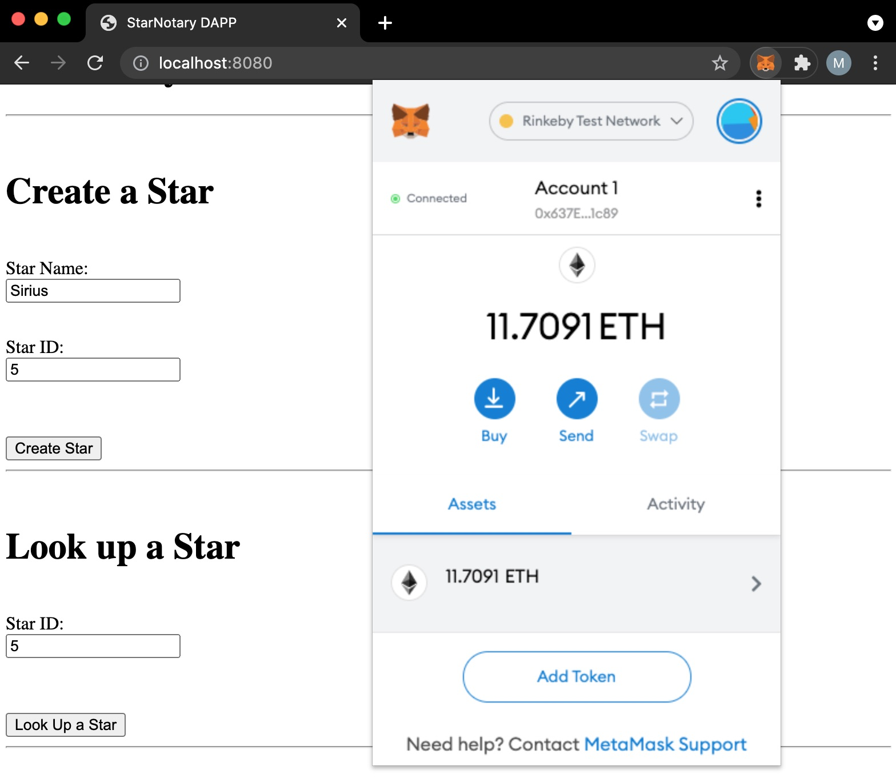

# Ethereum CryptoStar Dapp

Ethereum CryptoStar Dapp is a star register.

- User can register a star as a non-fungible token (ERC-721)
- User can search the stars

This is the 2nd project from the
[Udacity - Blockchain Developer Nanodegree Program](https://www.udacity.com/course/blockchain-developer-nanodegree--nd1309)

## Required for submission info:

- Truffle version = v5.1.65
- Ganache version = 2.5.4.1367
- OpenZeppelin version = 2.1.2
- ERC-721 Token Name = AmazingCryptoStar
- ERC-721 Token Symbol = ACS
- “Token Address” on the Rinkeby Network = 0xe73b80eeD3238C027cD22b42b87513112a54452E
- Contract: https://rinkeby.etherscan.io/address/0xe73b80eeD3238C027cD22b42b87513112a54452E

## Setup the project

### Setup Back-end

Please note that in order to compile the back-end you need to have node_modules folder in root.
This one uses obsoleted libraries. You should include them manually from here https://s3.amazonaws.com/video.udacity-data.com/topher/2019/January/5c51c4c0_project-5-starter-code/project-5-starter-code.zip

When you are ready just:
- start Ganache (http://127.0.0.1:7545)
- install truffle 'npm install -g truffle' (if not already installed)
- execute: 'truffle compile' to compile the contracts
- execute: 'truffle migrate --reset' to deploy the contracts to Granache

### Testing the Back-end

If you want to run tests at HTTP://127.0.0.1:9545 without affecting your Ganache env at http://127.0.0.1:7545 do the following:
- execute 'truffle develop' and you will go in truffle CLI
- execute 'test' and the tests will start
- just control that Granache has not added additional transaction at the end of the test
- at the end write '.exit' to exit the truffle CLI

### Deploy the contract to Rinkeby Test Network

- create a file .secret in root folder with a mnemonic seed for Rinkeby network with enough credit
- create a file .rinkeby-infurakey containing your rinkeby infurakey  
- be sure that you never commit .secret and .rinkeby-infurakey to GitHub (.gitignore)
- execute 'truffle migrate --network rinkeby' to deploy it to the Rinkeby network

### Setup Front-end

- enter in app with 'cd app'
- execute 'npm install' to install all node_modules required (if not already installed)
- execute 'npm run dev' to start the front-end
