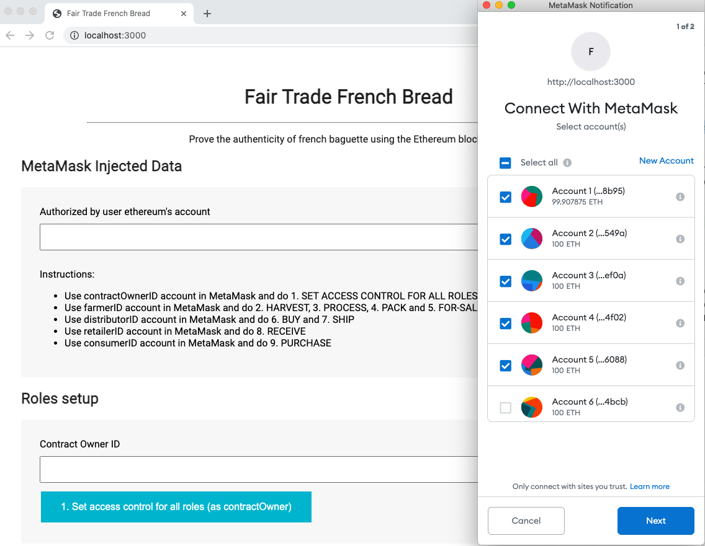
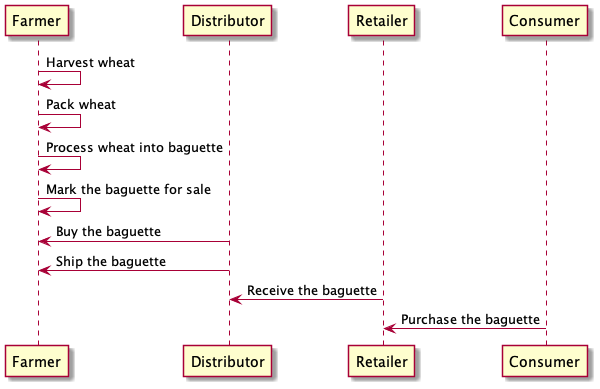
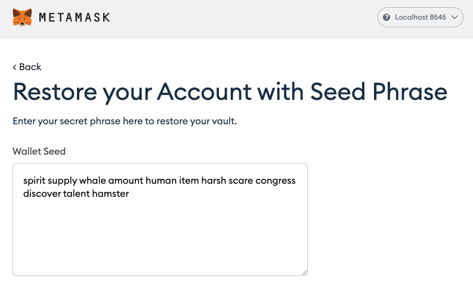
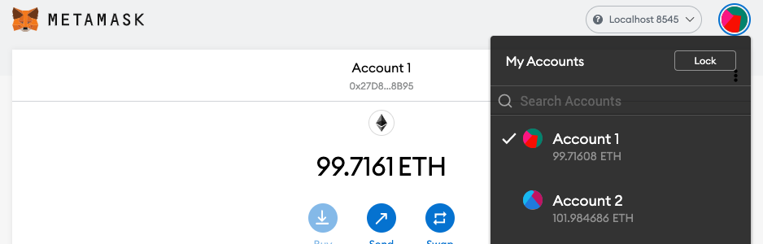
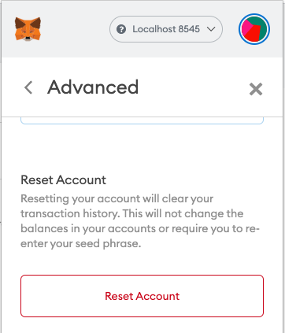
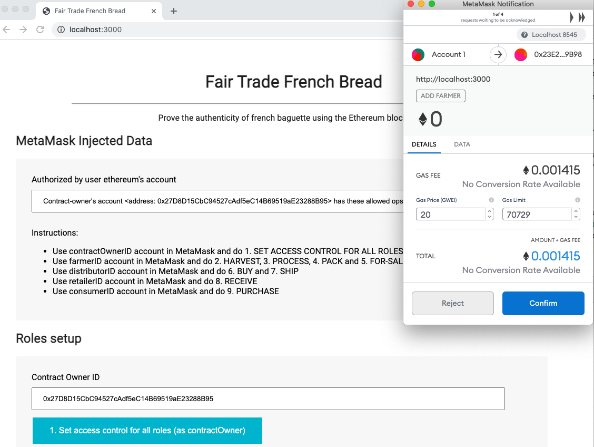

# Ethereum SupplyChain Dapp

Ethereum SupplyChain Dapp is a supply chain item's tracker.

- The product's authenticity can be tracked and audited
- The smart contracts have a fine-grain user permission's management
- A state machine controls the correct state transition

This is the 3th project from the
[Udacity - Blockchain Developer Nanodegree Program](https://www.udacity.com/course/blockchain-developer-nanodegree--nd1309)





### Required for submission info:

- Contract address: https://rinkeby.etherscan.io/address/0x3dFacD7FbC83FF51Fc4eA2F74d529De704B9E31F
- Program version number: 1.0.0 (src/js/app.js)
- Node v10.15.3
- Truffle v5.3.6 (core: 5.3.6)
- Solidity v0.5.16 (solc-js)
- Web3.js v1.3.5
- Ganache CLI v6.12.2 (ganache-core: 2.13.2)
- MetaMask 9.5.2

### [Domain Model](res/domain-model.md)

### Interfaces

- AccessControl - Collection of Contracts: These contracts manages the various addresses and constraints for operations
  that can be executed only by specific roles.
- Base - SupplyChain.sol: This is where we define the most fundamental code shared throughout the core functionality.
  This includes our main data storage, constants and data types, plus internal functions for managing these items.
- Core - Ownable.sol: is the contract that controls ownership and transfer of ownership.

#### Build

`ganache-cli -m "spirit supply whale amount human item harsh scare congress discover talent hamster"`
=> [log](res/ganache-cli-log.md)

`truffle compile` => [log](res/truffle-compile-log.md)

`truffle migrate` => [log](res/truffle-migrate-log.md)

#### Testing

For this project, as with any project, make sure to test your smart contracts to ensure they are working properly in
different situations without any risk.

`truffle test` => [log](res/truffle-test-log.md)

### Deploy To Rinkeby

Using Truffle framework, deploy your smart contract with the Rinkeby test network. Take note of your contract hash and address after successful deployment.

- install 'npm install @truffle/hdwallet-provider' if not already installed
- install 'npm install truffle-hdwallet-provider@web3-one' if not already installed
- create a file .secret in root folder with a mnemonic seed for Rinkeby network with enough credit
- create a file .rinkeby-infurakey containing your rinkeby infurakey
- be sure that you never commit .secret and .rinkeby-infurakey to GitHub (.gitignore)
- execute 'truffle migrate --network rinkeby' to deploy it to the Rinkeby network

`truffle migrate --network rinkeby`=> [log](res/rinkeby-deployment-log.md)

- contract hash: 0xa5dca8e800e007172d2bdb27673feacf30564469d647a9d8bc33fbaea973856e
- contract address: 0x3dFacD7FbC83FF51Fc4eA2F74d529De704B9E31F

#### Contract Address

Provide a document with your project submission that includes the contract address.

- contract address: https://rinkeby.etherscan.io/address/0x3dFacD7FbC83FF51Fc4eA2F74d529De704B9E31F

#### Front-End

Front-end is configured to:

- Submit a product for shipment (farmer to the distributor, distributor to retailer, etc).
- Receive product from shipment.
- Validate the authenticity of the product.️

Frontend code can be downloaded and executed from a local environment.

#### Setup instructions ️

- Stop first all running ganache-cli, truffle and npm instances (required a fresh start to test the UI)
- Install ganache-cli if not already installed 'npm install -g ganache-cli'
- Start in a new terminal ganache-cli to simulate an ethereum blockchain locally with predefined addresses

```bash
=> ganache-cli -m "spirit supply whale amount human item harsh scare congress discover talent hamster"
```

- Install truffle if not already installed 'npm install -g truffle'
- Start in a new terminal truffle to deploy the contracts to the local blockchain

```bash
=> truffle compile
=> truffle migrate
```

- Install all node dependencies 'npm install'
- Make sure the first 5 addresses (contractOwnerID .. consumerId) found in src/js/app.js are exactly the same created by
  ganache-cli. If you want to use different addresses please update app.js
- Download in browser the latest MetaMask version (tested with MetaMask 9.5.2 in Chrome)
- Using Localhost 8545 import in MetaMask all accounts with the seed "spirit supply whale amount human item harsh scare
  congress discover talent hamster"

  
- Select in MetaMask the first address which is the contract creator

  
- In case you restarted ganache or if you have change the account without refreshing the front-end, it's always a good
  idea to do Restart Account to avoid some internal MetaMask transaction state problems

  
- Start the front-end 'npm run dev'
- Open in the browser with MetaMask 'http://localhost:3000'
- After the app has started, it will try to connect to your accounts in MetaMask. Authorize all your first 5 accounts

  
- Now, the first step to do as contract creator is to assign roles to the farmer, distributor, retailer and consumer
  account. To do that:
  - Click on the button [1. Set access control for all roles (as contractOwner)]
  - After that authorize the role assignment for the four other accounts in the popups which will appear automatically

    
  - If everything has worked fine, you should see in the bottom of UI the contract events, certifying the roles creation
- The second step in the process is to do all actions as farmer:
  - Select Account2 from MetaMask
  - Reset the account from MetaMask
  - At this point you should see in UI that the switch from contractOwner to the Farmer account has worked
  - Click the buttons [Harvest], [Process], [Pack] and [For Sale]. After each step a confirm from MetaMask will be ask
    to provide enough gas for contract execution
  - If everything has worked fine, you should see in the bottom of UI the contract events, certifying the actions
    performed
- The third step in the process is to do all actions as distributor:
  - Select Account3 from MetaMask
  - Reset the account from MetaMask
  - At this point you should see in UI that the switch from Farmer to the Distributor account has worked
  - Click the buttons [Buy] and [Ship]. After each step a confirm from MetaMask will be ask to provide enough gas for
    contract execution
  - If everything has worked fine, you should see in the bottom of UI the contract events, certifying the actions
    performed
- The fourth step in the process is to do all actions as retailer:
  - Select Account4 from MetaMask
  - Reset the account from MetaMask
  - At this point you should see in UI that the switch from Distributor to the Retailer account has worked
  - Click the button [Receive] and confirm from MetaMask to provide enough gas for contract execution
  - If everything has worked fine, you should see in the bottom of UI the contract event, certifying the action
    performed
- The fifth final step in the process is to do all actions as consumer:
  - Select Account5 from MetaMask
  - Reset the account from MetaMask
  - At this point you should see in UI that the switch from Retailer to the Consumer account has worked
  - Click the button [Purchase] and confirm from MetaMask to provide enough gas for contract execution
  - If everything has worked fine, you should see in the bottom of UI the contract event, certifying the action
    performed
- At the end you will see the whole transaction history:

```bash
Transaction History
  FarmerAdded - 0x81b1da8ec35bd49f989c2460b20f63c6e0d515604cabf7cf680c2593653ab9c3
  DistributorAdded - 0x464aa0fcac7ab5d1e398f16c2c20949f27b323f01b7df2c5ce04194bc615d86c
  RetailerAdded - 0x44480a56784f9ae9f67a546ca0b7e1c319239637816b69383d258e812bfbf1bf
  ConsumerAdded - 0x61de653122cee4c294b1b70cb1a025e9c1c226d225f4a86c3296c2a4b9a74a9c
  ConsumerAdded - 0x61de653122cee4c294b1b70cb1a025e9c1c226d225f4a86c3296c2a4b9a74a9c
  Harvested - 0x31a6219ce951732fd46c2e839e57d1836eec9d6dc099267c12b38329f1700e93
  Processed - 0x8453c4f37f792067a58044e659f21b71a2ae60f01d72c0d052fb0ec4ae0ea692
  Packed - 0x42ffa3d72ebff307351558c8e8c721107aecef176b7a663a62967c3fcc3b4a2d
  ForSale - 0x23825876619065b1fef47c4ce1037dafe27edfcb4dd2617ad7b825d9b783cd70
  ForSale - 0x23825876619065b1fef47c4ce1037dafe27edfcb4dd2617ad7b825d9b783cd70
  Sold - 0x63583915a4f6b9e4efa811a387fa94c1884a5f4b329c1796e31facde33271798
  Shipped - 0xc199b671227ba283a7556dc1500b8631c75af78cd54061d067f935409dd8d5e4
  Shipped - 0xc199b671227ba283a7556dc1500b8631c75af78cd54061d067f935409dd8d5e4
  Received - 0x82b1502b839609658ceb2494a0692c5e094193a745ef1bb69cb05fba8b140c87
  Received - 0x82b1502b839609658ceb2494a0692c5e094193a745ef1bb69cb05fba8b140c87
  Purchased - 0xa164a9cc67e327ffc0d4db368b6f6e5cc2c9efb4e3b9f12d82577c911feea101
```

(!) Please note that the reason for the duplicates (but with the same hashcode) is that when the account in UI changes,
the last event is popping out again.

(!) If you want to run the whole process again you have two options:

- opt1: Restart ganache and the whole blockchain
- opt2: Change manually in app.js the code of UPC from 1 to 2 for example and then run the UI again This is a simple
  GUI. So no effort was invested to make it usable. It's just good enough to test the contracts.
