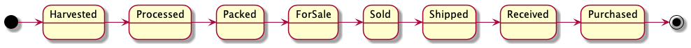
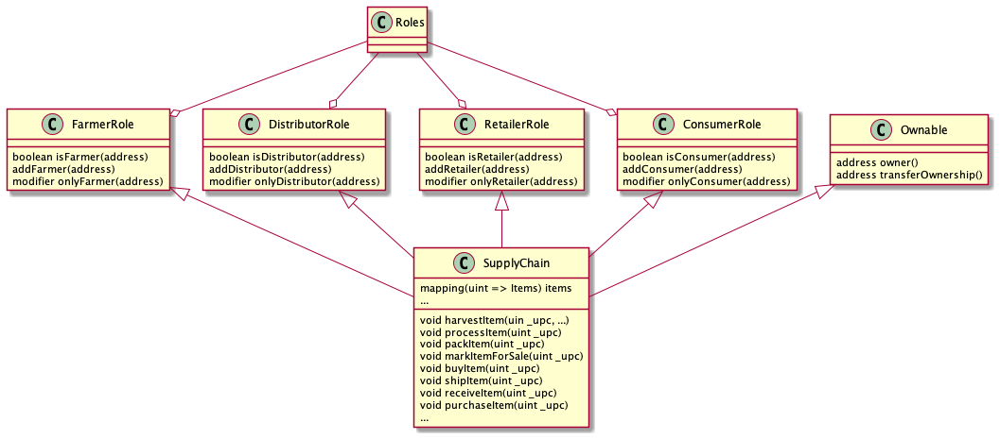

# Udacity - Blockchain Developer Nanodegree Program

## Project 3 - Ethereum Dapp for Tracking Items through Supply Chain

### Project Details

For this project, you will creating a DApp supply chain solution backed by the Ethereum platform.

You will architect smart contracts that manage specific user permission controls as well as contracts that track and
verify a product’s authenticity.

### 1. Part 1 - Plan the project with write-ups ✔️

#### 1.1. Requirement 1 - Project write-up - UML ✔️

##### Planning Overview ✔️

- Selected supply chain: French bread production and distribution

- Assets:
    - wheat
    - baguette

- Actors:
    - farmer
    - distributor
    - retailer
    - consumer

- Roles:

| Actor | Role |
|:---:|:---:|
|Farmer|can harvest wheat|
|Farmer|can process wheat into baguette|
|Farmer|can pack the baguette|
|Farmer|can mark the baguette for sale|
|Distributor|can buy the baguette|
|Distributor|can ship the baguette|
|Retailer|can receive the baguette|
|Consumer|can purchase the baguette|

#### Activity Diagram ✔️


##### Sequence Diagram ✔️


##### State Diagram ✔️



##### Class Diagram ✔️



#### 1.2. Requirement 2 - Project write-up - Libraries ✔️️

If libraries are used in the project, the project write-up indicates which libraries and discusses why these libraries
were adopted.

| Libraries used | Version | Motivation |
|:---:|:---:|:---:|
|web3.min.js|0.19.0|To allow interaction with ethereum contracts from browser|
|truffle-contract.js|0.5.5|To allow interaction with ethereum contracts from browser|
|jquery-3.6.0.min.js|3.6.0|To build very simple front-end (the focus of the project are the contracts)|

#### 1.3. Requirement 3 - Project write-up - IPFS ✔️

If IPFS is used, the project write-up discusses how IPFS is used in this project.

| Libraries used | Version | Motivation |
|:---:|:---:|:---:|
|IPFS not used|N/A|N/A|

### 2. Part 2	Write smart contracts ✔️

#### 2.1. Requirement 1: Define and implement required interfaces ✔️

- AccessControl - Collection of Contracts: These contracts manages the various addresses and constraints for operations that can be executed only by specific roles. ✔️
- Base - SupplyChain.sol: This is where we define the most fundamental code shared throughout the core functionality. This includes our main data storage, constants and data types, plus internal functions for managing these items. ✔️
- Core - Ownable.sol: is the contract that controls ownership and transfer of ownership. ✔️

#### 2.2. Requirement 2: Build out AccessControl Contracts ✔️
#### 2.3. Requirement 3: Build out Base Contract ✔️
#### 2.4. Requirement 4: Build out Core Contract ✔️

```bash
=> ganache-cli -m "spirit supply whale amount human item harsh scare congress discover talent hamster"

Ganache CLI v6.12.2 (ganache-core: 2.13.2)

Available Accounts
==================
(0) 0x27D8D15CbC94527cAdf5eC14B69519aE23288B95 (100 ETH)
(1) 0x018C2daBef4904ECbd7118350A0c54DbeaE3549A (100 ETH)
(2) 0xCe5144391B4aB80668965F2Cc4f2CC102380Ef0A (100 ETH)
(3) 0x460c31107DD048e34971E57DA2F99f659Add4f02 (100 ETH)
(4) 0xD37b7B8C62BE2fdDe8dAa9816483AeBDBd356088 (100 ETH)
(5) 0x27f184bdc0E7A931b507ddD689D76Dba10514BCb (100 ETH)
(6) 0xFe0df793060c49Edca5AC9C104dD8e3375349978 (100 ETH)
(7) 0xBd58a85C96cc6727859d853086fE8560BC137632 (100 ETH)
(8) 0xe07b5Ee5f738B2F87f88B99Aac9c64ff1e0c7917 (100 ETH)
(9) 0xBd3Ff2E3adEd055244d66544c9c059Fa0851Da44 (100 ETH)

=> truffle compile

Compiling your contracts...
===========================
> Compiling ./contracts/Migrations.sol
> Compiling ./contracts/coffeeaccesscontrol/ConsumerRole.sol
> Compiling ./contracts/coffeeaccesscontrol/DistributorRole.sol
> Compiling ./contracts/coffeeaccesscontrol/FarmerRole.sol
> Compiling ./contracts/coffeeaccesscontrol/RetailerRole.sol
> Compiling ./contracts/coffeeaccesscontrol/Roles.sol
> Compiling ./contracts/coffeebase/SupplyChain.sol
> Compiling ./contracts/coffeecore/Ownable.sol
> Artifacts written to /Users/andreystoev/development/projects/blockchain-projects/udacity-projects/OLD/ethereum-supply-chain-n-data-auditing-dapp/project-6/build/contracts
> Compiled successfully using:
- solc: 0.5.16+commit.9c3226ce.Emscripten.clang

=> truffle migrate

Starting migrations...
======================
> Network name:    'development'
> Network id:      1621168386807
> Block gas limit: 6721975 (0x6691b7)


1_initial_migration.js
======================

   Deploying 'Migrations'
   ----------------------
   > transaction hash:    0x201e8d72d00c5242b83a7e3899269ae9cae0e5925bf0044825155c0c985efbf8
   > Blocks: 0            Seconds: 0
   > contract address:    0xFEeCfF2CB7d6f3BfcBE5fa41c49c8fB642f2dDbF
   > block number:        1
   > block timestamp:     1621168499
   > account:             0x27D8D15CbC94527cAdf5eC14B69519aE23288B95
   > balance:             99.99549526
   > gas used:            225237 (0x36fd5)
   > gas price:           20 gwei
   > value sent:          0 ETH
   > total cost:          0.00450474 ETH


   > Saving migration to chain.
   > Saving artifacts
   -------------------------------------
   > Total cost:          0.00450474 ETH


2_deploy_contracts.js
=====================

   Deploying 'FarmerRole'
   ----------------------
   > transaction hash:    0x648e08d9fadeebfa6c3bf51edf133fd7e7c0635e1a8df864df4871996c05ee9f
   > Blocks: 0            Seconds: 0
   > contract address:    0xf2ee0b0Cdcae5013930B92c0Ba54F7F7f1933613
   > block number:        3
   > block timestamp:     1621168499
   > account:             0x27D8D15CbC94527cAdf5eC14B69519aE23288B95
   > balance:             99.98841844
   > gas used:            311478 (0x4c0b6)
   > gas price:           20 gwei
   > value sent:          0 ETH
   > total cost:          0.00622956 ETH


   Deploying 'DistributorRole'
   ---------------------------
   > transaction hash:    0x15ba56027efbd12978b21f9a04ff7bedd914ba54a7157f7a08759919669d57a2
   > Blocks: 0            Seconds: 0
   > contract address:    0xd22De155853B67cE1cA3693FBE52EE958f755E7b
   > block number:        4
   > block timestamp:     1621168499
   > account:             0x27D8D15CbC94527cAdf5eC14B69519aE23288B95
   > balance:             99.98218912
   > gas used:            311466 (0x4c0aa)
   > gas price:           20 gwei
   > value sent:          0 ETH
   > total cost:          0.00622932 ETH


   Deploying 'RetailerRole'
   ------------------------
   > transaction hash:    0x27fb361acb66de5a863c582bca2abcdc35db4409fc2b2384dabcfeceabd37456
   > Blocks: 0            Seconds: 0
   > contract address:    0x79051A2faFcC216A55d3897474012145d158F170
   > block number:        5
   > block timestamp:     1621168499
   > account:             0x27D8D15CbC94527cAdf5eC14B69519aE23288B95
   > balance:             99.97595956
   > gas used:            311478 (0x4c0b6)
   > gas price:           20 gwei
   > value sent:          0 ETH
   > total cost:          0.00622956 ETH


   Deploying 'ConsumerRole'
   ------------------------
   > transaction hash:    0xdf595e7a1a075e0d08346b6c2c73e183b4cfbc9db078db9d78be92638968d0ca
   > Blocks: 0            Seconds: 0
   > contract address:    0xA65B87754E0A73860AA6B7eb6E95D79CD2d893d2
   > block number:        6
   > block timestamp:     1621168500
   > account:             0x27D8D15CbC94527cAdf5eC14B69519aE23288B95
   > balance:             99.96973024
   > gas used:            311466 (0x4c0aa)
   > gas price:           20 gwei
   > value sent:          0 ETH
   > total cost:          0.00622932 ETH


   Deploying 'SupplyChain'
   -----------------------
   > transaction hash:    0xc5bac4786429cfd5b5d64fa91499ea6614a32338098cfc070d2d1b36225764bd
   > Blocks: 0            Seconds: 0
   > contract address:    0x23E2b13b08a22E9eEe431F862eC7A17aB1E99B98
   > block number:        7
   > block timestamp:     1621168500
   > account:             0x27D8D15CbC94527cAdf5eC14B69519aE23288B95
   > balance:             99.90842158
   > gas used:            3065433 (0x2ec659)
   > gas price:           20 gwei
   > value sent:          0 ETH
   > total cost:          0.06130866 ETH


   > Saving migration to chain.
   > Saving artifacts
   -------------------------------------
   > Total cost:          0.08622642 ETH


Summary
=======
> Total deployments:   6
> Final cost:          0.09073116 ETH

```

### 3. Part 3	Test smart contract code coverage

### 4. Part 4	Deploy smart contracts on a public test network (Rinkeby)

### 5. Part 5	Modify client code to interact with smart contracts
