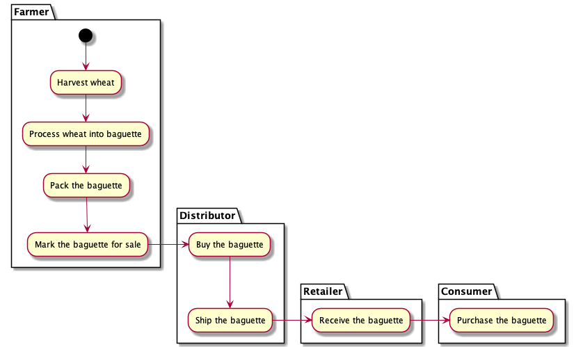
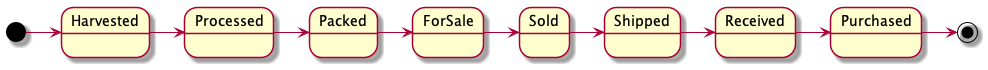
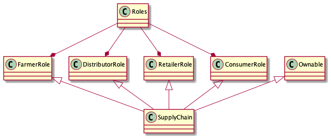

## Domain Model

### Assets & Actors

- Selected supply chain: French bread production and distribution

- Assets:
  - wheat
  - baguette

- Actors:
  - farmer
  - distributor
  - retailer
  - consumer

- Roles:

| Actor | Role |
|:---:|:---:|
|Farmer|can harvest wheat|
|Farmer|can process wheat into baguette|
|Farmer|can pack the baguette|
|Farmer|can mark the baguette for sale|
|Distributor|can buy the baguette|
|Distributor|can ship the baguette|
|Retailer|can receive the baguette|
|Consumer|can purchase the baguette|

### Activity Diagram

### Sequence Diagram

### State Diagram

### Class Diagram

### Libraries ️

| Libraries used | Version | Motivation |
|:---:|:---:|:---:|
|web3.min.js|0.19.0|To allow interaction with ethereum contracts from browser|
|truffle-contract.js|0.5.5|To allow interaction with ethereum contracts from browser|
|jquery-3.6.0.min.js|3.6.0|To build very simple front-end (the focus of the project are the contracts)|

### IPFS

| Libraries used | Version | Motivation |
|:---:|:---:|:---:|
|IPFS not used|N/A|N/A|
