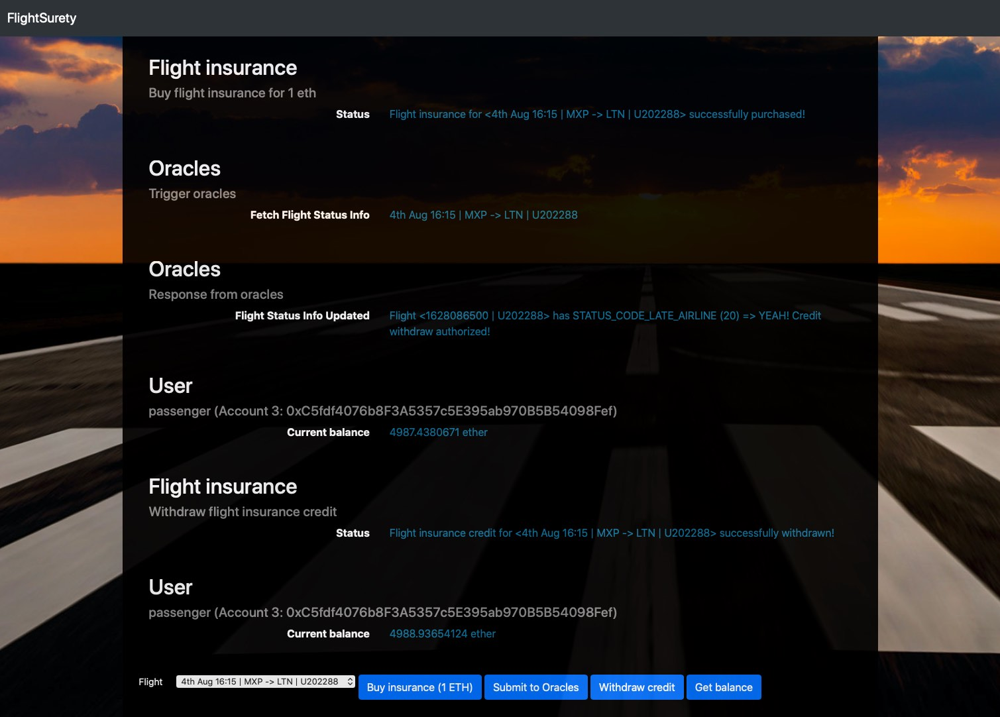
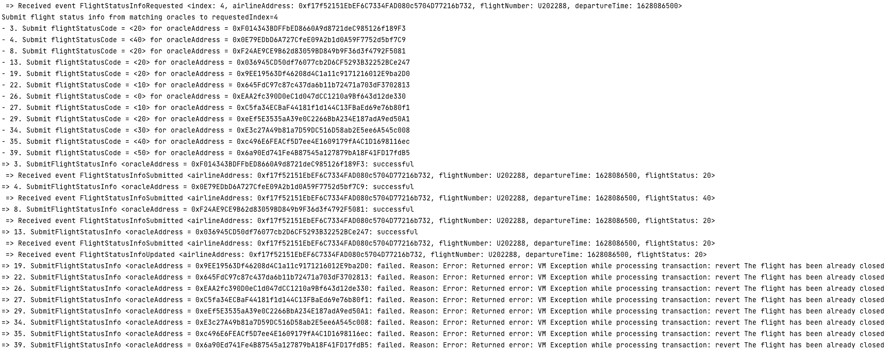

# Ethereum FlightSurety Dapp

Ethereum FlightSurety Dapp is a flight delay insurance for passengers.

- Managed as a collaboration between multiple airlines
- The passengers purchase insurance prior to flight
- If flight is delayed due to airline fault, passengers are paid 1.5X the amount they paid for the insurance
- Oracles provide flight status information
- The smart contract is upgradable

This is the 4th project from the
[Udacity - Blockchain Developer Nanodegree Program](https://www.udacity.com/course/blockchain-developer-nanodegree--nd1309)

## Structure

The repository contains:

- contracts: Back-end ethereum smart contracts (deployable from Truffle)
- test: Back-end mocha unit testing (executable from Truffle)
- src/server: Back-end NodeJs oracle server App (executable from Webpack)
- src/dapp: Front-end javascript/web3.js dApp (executable from Webpack)

## Install

Compatible with:

* Truffle v5.3.7 (core: 5.3.7)
* Solidity v0.8.5 (solc-js)
* Node v16.2.0
* Web3.js v1.3.6
* Ganache CLI v6.12.2 (ganache-core: 2.13.2)

Run:

`npm install`

`truffle compile`

## Develop Back-End

To deploy the smart contracts locally with 50 account with default 5000 ether per account:

`ganache-cli -m "candy maple cake sugar pudding cream honey rich smooth crumble sweet treat" -a 50 -e 5000`

`truffle migrate`

To test it:

`npm run test` or `truffle test ./test/FlightSurety.test.js`

To run the oracles:

`npm run server`

## Develop Front-End

To use the dApp:

`truffle migrate`

`npm run dapp`

To view the dApp:

`http://localhost:8000`

## User Interface

### Successful flight credit insurance withdraw

### The accepted result from the oracles is STATUS_CODE_LATE_AIRLINE (20)

## Resources

* [How does Ethereum work anyway?](https://medium.com/@preethikasireddy/how-does-ethereum-work-anyway-22d1df506369)
* [BIP39 Mnemonic Generator](https://iancoleman.io/bip39/)
* [Truffle Framework](http://truffleframework.com/)
* [Ganache Local Blockchain](http://truffleframework.com/ganache/)
* [Remix Solidity IDE](https://remix.ethereum.org/)
* [Solidity Language Reference](http://solidity.readthedocs.io/en/v0.4.24/)
* [Ethereum Blockchain Explorer](https://etherscan.io/)
* [Web3Js Reference](https://github.com/ethereum/wiki/wiki/JavaScript-API)
