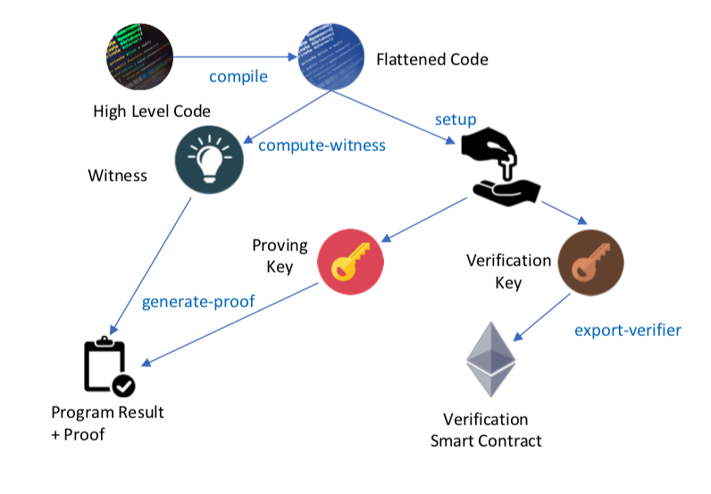

# Ethereum Real Estate Marketplace

Ethereum Real Estate Marketplace is a decentralized marketplace for house property owners.

- Every house property is mint as NFT
- zk-SNARKs proof protects the title's ownership privacy
- A title ownership can be verified through an ethereum solidity contract
- House properties can be traded on a public NFT marketplace OpenSea

This is the 5th capstone project from
the [Udacity - Blockchain Developer Nanodegree Program](https://www.udacity.com/course/blockchain-developer-nanodegree--nd1309)

## Structure

The repository contains:

- zokrates: "Genesis" for zk-SNARKs proof and solidity verifier contract
- eth-contracts/contracts: ethereum smart contracts
- eth-contracts/test: Mocha unit testing (executable through Truffle)

## Install

Compatible with:

* Truffle v5.3.7 (core: 5.3.7)
* Solidity v0.8.4 (solc-js)
* Node v16.2.0
* Web3.js v1.3.6
* Ganache CLI v6.12.2 (ganache-core: 2.13.2)
* Zokrates v0.7.3

Run:

`npm install`

`truffle compile`

## Develop Back-End

###  

### Zokrates



```bash
cd zokrates
zokrates compile -i square.code
zokrates setup
zokrates compute-witness -a 3 9
```

- Copy 'zokrates/verifier.sol' to 'contracts/SquareVerifier.sol' and upgrade its version to 0.5.17

# Project Resources

* [Remix - Solidity IDE](https://remix.ethereum.org/)
* [Truffle Framework](https://truffleframework.com/)
* [Ganache - One Click Blockchain](https://truffleframework.com/ganache)
* [Open Zeppelin ](https://openzeppelin.org/)
* [Interactive zero knowledge 3-colorability demonstration](http://web.mit.edu/~ezyang/Public/graph/svg.html)
* [Docker](https://docs.docker.com/install/)
* [ZoKrates](https://zokrates.github.io/gettingstarted.html)
* [OpenSea](https://opensea.io/)
